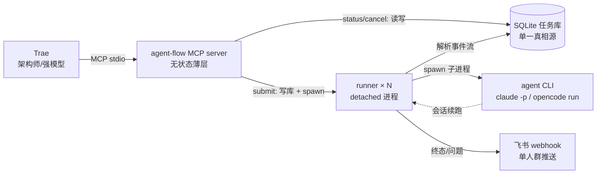

# agent-flow 项目规格说明书 v2

**项目名称**：`agent-flow`（原名 `cc-connect-flow` / `cc-flow`，2026-08-16 更名）
**版本**：v2.0
**状态**：设计完成，待评审
**最后更新**：2026-08-16
**替代**：`2026-08-16-project-init-spec.md`（v1 已作废，保留归档）

---

## 1. 定位与背景

### 1.1 从 v1 到 v2 的转向

v1 将本服务定位为「cc-connect 的上层 MCP 网关」。经核对 `cc-connect` 实际代码，该定位不成立：

- **API 错位**：v1 引用的 `POST /projects/{name}/prompt`、`POST .../sessions/{id}/cancel` 端点不存在；`GET .../sessions/{id}` 只返回 `live`(bool) 与 history，无任务语义（详见 `../cc-connect/core/management.go` 的 `handleProjectRoutes`）。
- **世界观冲突**：cc-connect 是「会话中心」（人在飞书持续对话）；本场景是「任务中心」（一次性大活 + 结果查询 + 追加指令）。cc-connect 里没有「任务」这个实体。
- **结论**：v2 不再依赖 cc-connect，直接驱动外部 agent CLI（headless 模式）。

### 1.2 定位

**给 Trae 造一个外挂的、异步的、可并行的外部编码 agent 子代理（worker）**，以「任务」为原子单位，用工单表（SQLite）承载协作，用飞书通知补齐跨进程闭环。worker 不限于特定 agent 工具。

### 1.3 协作模型（对等但侧重）

Trae 运行强模型 = **架构师 / 技术负责人**；worker 运行较便宜模型（如 M3）= **执行工程师**。

- Trae 负责：方案设计、验收、答疑、决策。
- worker 负责：执行编码、自查、整理问题回报。
- 沟通机制：`needs_input` 循环（见 §4.3），实现「执行遇到问题回头问架构师」。

### 1.4 worker 工具选型（headless 是行业标配）

经实证（2026-08），headless（`-p` 类）能力并非 Claude Code 独有：

| 工具 | headless 命令 | 会话续跑 | 结构化输出 |
| :--- | :--- | :--- | :--- |
| Claude Code | `claude -p` | `--resume <sid>` | `--output-format stream-json` |
| opencode | `opencode run` | `-c` / `-s` | `--format json` |
| Codex CLI | `codex exec` | session 内 | 有 |

- v1 实现 **claude executor**（当前默认）。
- **opencode executor** 为预留第二实现（75+ providers，天然覆盖 minimax-3 / ds-v4 / 本地 MLX 等）。
- 抽象边界见 §7，不绑定单一 agent。

---

## 2. 核心架构

### 2.1 组件

| 组件 | 角色 | 生命周期 |
| :--- | :--- | :--- |
| **MCP server** | 无状态薄层：派发任务、查询状态、取消 | IDE（Trae）拉起/销毁，stdio |
| **runner** | 每任务一个 detached 进程，执行 agent CLI 并回报 | 随任务自生自灭，独立于 MCP server |
| **任务库** | SQLite（WAL），单一真相源 | 常驻磁盘 |
| **飞书通知** | 单人群 webhook，单向推送 | 无状态 HTTP |

### 2.2 架构图



### 2.3 关键设计原则

1. **单一真相源**：任务库是唯一承载数据的地方；MCP server 与 runner 都是它的客户端，两者互不感知、可独立生死。
2. **无常驻 daemon**：runner 自包含生命周期（执行→落库→通知），MCP server 崩溃不影响任务完成。
3. **上下文用指针不拷贝**：worker 的记忆在 agent CLI 自己的 session 存储（存 `session_id` 指针），Trae 的记忆在 Trae 侧，跨边界只传指针 + 结构化摘要。
4. **即查即返**：所有 MCP 工具内部严禁同步阻塞等待，绝不触发 IDE 60 秒超时。
5. **异步通知优于轮询**：轮询只做主动查询；状态变化（完成/失败/卡住）由飞书推送。

---

## 3. 任务库 Schema

路径：`~/.agent-flow/tasks.db`，单表 `tasks`。

| 字段 | 写入方 | 说明 |
| :--- | :--- | :--- |
| `id` | MCP server | `task_<timestamp>_<rand>` |
| `status` | 双方 | 见 §5 状态机 |
| `prompt` | MCP server | 原始工单（首轮） |
| `project_path` | MCP server | 工作目录 |
| `executor` | MCP server | CLI 类型（如 `claude`），由 profile 解析而来 |
| `profile` | MCP server | 使用的 profile 名（如 `minimax-3`） |
| `timeout_sec` | MCP server | 本任务超时（提交时从 config/参数落定，config 变更不影响已提交任务） |
| `session_id` | runner | 首轮启动时从事件流提取，供会话续跑 |
| `rounds` | MCP server | 轮次计数（needs_input 循环，续跑时 +1） |
| `result` | runner | 最近一轮最终 assistant 文本（截断存储） |
| `question` | runner | needs_input 时提取的问题 |
| `progress` | runner | 最近工具调用摘要（如 "Editing auth.py…"） |
| `files_changed` | runner | 从 Edit/Write 事件累计 |
| `pid` | MCP server | runner 进程 pid（cancel 用） |
| `error` | runner | 失败原因 |
| `log_path` | runner | 原始事件流全量日志文件路径 |
| `created_at` / `started_at` / `ended_at` | 双方 | elapsed_sec = started_at 起墙钟时间（含 needs_input 等待） |
| `notify_failed` | runner | webhook 重试耗尽后置位，供补发 |

存储策略：库存**结构化摘要**（喂给 Trae 上下文）；**原始事件流全量日志**落文件 `~/.agent-flow/logs/{task_id}.jsonl`，库只存路径。各轮答疑 prompt 追加写入日志文件，`prompt` 字段保持首轮原文。需要看全文时由 Trae 直接 Read 文件（零 MCP 成本）。

---

## 4. 核心数据流

### 4.1 提交（<200ms）

1. Trae 决定派活，调用 `agent_flow_submit(prompt, project_path?, profile?)`。
2. **新任务**：MCP server 写库（`queued`，解析 profile → executor + env，落定 timeout_sec），spawn detached runner（新进程组），立即返回新 `task_id`。
3. **续跑**（带 `continue_of`）：校验目标任务 `status=needs_input`（否则拒绝并返回明确错误），`rounds+1`、状态转 `running`，答案追加至日志，spawn 新 runner（按 `session_id` 会话续跑），**返回同一 `task_id`**（不建新行）。
4. runner 加载任务行，按 executor 组装命令（环境 + prompt），执行。

### 4.2 状态查询（即查即返）

- MCP server 读库，返回结构化状态：`status`、`elapsed_sec`、`progress`、`files_changed`、`rounds`。
- `needs_input` 时额外返回 `question`。
- 支持无参数调用：返回所有活跃任务摘要数组（人一句「看下任务」一次拿全）。

### 4.3 needs_input 循环（执行遇到问题回头问架构师）

```
Trae 派活 ──> worker 执行
                  │ 遇到无法自行决策的阻塞
                  ▼
        worker 输出 ❓NEEDS_INPUT:<问题>   （prompt 契约约束，见 §8）
                  │
        runner 解析 → 库置 needs_input + question + session_id
                  │
        飞书推送「任务卡住，问题：xxx」──> 人 → 回 Trae 说「看下任务」
                  │
        Trae 调 status 拿 question → 组织答案
                  │
        agent_flow_submit(答案, continue_of=task_id)
                  │
        同一任务新轮次（rounds+1，返回同一 task_id）
        runner 会话续跑（session 恢复，答案作为新 user 消息追加）──> 续跑
```

### 4.4 飞书通知（单向，人即事件循环）

- 仅三类事件推送：`needs_input`（带问题摘要）、`failed`（带错误）、`completed`（带结果摘要）。
- `running` 不推。推送由 runner 直接发 webhook，不经 MCP server。
- 重试：3 次退避；耗尽则置 `notify_failed` 留待补发。

---

## 5. 状态机

```
        +-------> queued ------> running ------> completed
        |             ^             |               |
        |             |             v               v
        |             |          needs_input    failed
        |             |             |               |
        |             |             v               |
        |             +------- (continue_of 续跑)   |
        |                                            |
        +------------------ cancelled <-------------+
```

- `queued → running`：runner 启动。
- `running → needs_input`：检测到 NEEDS_INPUT 标记。
- `needs_input → running`：收到 `continue_of` 续跑——**同一任务行的新轮次**（rounds+1，非新任务）。
- 任一非终态可达 `cancelled`。
- **轮次上限（runner 侧检查）**：某轮以 NEEDS_INPUT 结束且 `rounds >= 5` 时，置 `failed`（error=轮次耗尽）而非 needs_input——submit 侧只需校验 status，无需处理超限拒绝。
- **超时**：runner 超过 `timeout_sec` 自杀（kill 进程组）→ `failed`（error=timeout）。
- **僵死检测**：status 查询时若 `running` 且 pid 不存活 → 置 `failed`（error=interrupted）。不引入独立 interrupted 状态。

---

## 6. MCP 工具契约

| 工具 | 描述 | 输入 | 输出要点 |
| :--- | :--- | :--- | :--- |
| **`agent_flow_submit`** | 派发新任务（或对 needs_input 任务答疑续跑） | `prompt`(req), `project_path`(opt，默认 MCP server cwd), `profile`(opt，默认取 config), `continue_of`(opt), `timeout_sec`(opt) | 新任务：新 `task_id` + `queued`；续跑：**同一 `task_id`** + `running` |
| **`agent_flow_status`** | 查询任务状态（无参数 = 全部活跃任务） | `task_id`(opt) | `status`, `elapsed_sec`, `progress`, `files_changed`, `rounds`, `question?`, `result?` |
| **`agent_flow_cancel`** | 取消任务（状态感知、幂等） | `task_id`(req) | `cancelled`；已终态则幂等返回当前状态 |

**cancel 状态感知**：`running` → kill 进程组后置 cancelled；`queued` / `needs_input`（无存活进程）→ 直接置 cancelled；已终态 → 幂等返回。runner 启动时校验状态，若已 cancelled 则立即退出（防竞态）。

### 6.1 工具描述文案（引导主模型行为）

`agent_flow_submit` 描述必须包含：
- 「prompt 需包含完整上下文、约束与验收标准——worker 不共享 Trae 上下文」
- 「任务已提交，卡住/完成会推飞书，无需轮询」
- 「多个任务写同一 project_path 会互相踩文件——plan 负责串行派发或确保改动文件不重叠」

`agent_flow_status` 描述必须包含：
- 「无参数调用返回全部活跃任务，用于一次性概览」

---

## 7. Executor 抽象与 Profile（环境断层解决方案）

### 7.1 问题

runner 是 detached 进程，不存在用户的 shell 环境——zsh function、alias、密钥文件一律不可用；而 Trae 拉起的 MCP server 本身也可能处于残缺 PATH。

**两层环境来源**：

1. **MCP 配置 env**（Trae 侧）：在 MCP 配置中声明基础环境变量（PATH 含 nvm node、keys），MCP server 与 runner 继承。
2. **Config + Profile**（agent-flow 侧，权威）：`~/.agent-flow/config.json` 声明完整运行环境，runner spawn 时**显式构造**，不依赖任何 shell 继承。两维结构：`executors`（CLI 类型：bin/flags）× `profiles`（命名组合：executor 引用 + env + 模型）。

### 7.2 Executor 接口

每个 executor 实现两个适配点（跨 CLI 的差异全部收敛于此）：

```typescript
interface Executor {
  name: string;                                   // 如 "claude" | "opencode"
  // 适配点 1：命令构造 —— 首次执行 / 会话续跑
  buildCommand(task: Task, round: Round): string[];
  // 适配点 2：事件解析 —— 从 CLI 输出流提取统一事件
  parseEvent(line: string): AgentEvent | null;    // AgentEvent: {sessionId, tool, filesChanged, needsInput?, assistantText, error?}
}
```

`AgentEvent` 是 runner 与具体 CLI 之间的唯一契约，runner 不感知底层是哪个 agent。

### 7.3 Config 结构示例

```jsonc
{
  "executors": {
    // CLI 类型维度：bin + 通用 flags
    // 注意：bin 路径含 node 版本号，升级 node 后需同步更新
    "claude": {
      "bin": "/Users/meow/.nvm/versions/node/v24.18.0/bin/claude",
      "extra_flags": ["--dangerously-skip-permissions"]
    }
  },
  // profile 维度：命名运行环境组合（对应 shell 里的 claude-minimax-3 / claude-ds-v4 等）
  "profiles": {
    "minimax-3": {
      "executor": "claude",
      "env": {
        "ANTHROPIC_BASE_URL": "https://api.minimaxi.com/anthropic",
        "ANTHROPIC_AUTH_TOKEN": "<MINIMAX_API_KEY>",
        "ANTHROPIC_MODEL": "MiniMax-M3[1m]",
        "ANTHROPIC_DEFAULT_SONNET_MODEL": "MiniMax-M3[1m]",
        "ANTHROPIC_DEFAULT_OPUS_MODEL": "MiniMax-M3[1m]",
        "ANTHROPIC_DEFAULT_HAIKU_MODEL": "MiniMax-M3[1m]"
      }
    },
    "ds-v4": {
      "executor": "claude",
      "env": { "/* 同构模板 */": "" }
    }
  },
  "notify": {
    // 飞书单人群自定义机器人 webhook
    "feishu_webhook_url": "<FEISHU_WEBHOOK_URL>"
  },
  "defaults": {
    "profile": "minimax-3",
    "timeout_sec": 3600
  }
}
```

- 密钥用环境变量占位（`<MINIMAX_API_KEY>` → 运行时从 env 读取），避免明文落盘。
- `agent_flow_submit` 的 `profile` 参数引用 `profiles` 键名；同一 CLI（executor）配不同 env 即得不同 provider——「claude + ds-v4」可表达。
- 默认 profile 为 `minimax-3`，复刻用户现有 `claude-minimax-3` 定义（源自 `~/devkits/dotfiles/claude/claude-code.shrc`）。

### 7.4 权限模式

沿用用户现有习惯：`--dangerously-skip-permissions`（无人值守任务的先决条件）。作为 executor 的显式字段，非全局默认，便于未来收紧为 `acceptEdits + allowedTools` 白名单。

### 7.5 v1 实现范围

- 完整实现 **claude executor**（`stream-json` 事件解析、`--resume` 续跑、NEEDS_INPUT 检测）。
- **opencode executor** 预留接口，Phase 2 实现（`--format json` 解析、`-c`/`-s` 续跑）。

---

## 8. Worker Prompt 契约

runner 在用户 prompt 外层统一包装一层行为契约，Trae 无需每次手写：

```
你是执行工程师，任务是：{user_prompt}

行为约束：
1. 遇到无法自行决策的阻塞（需求歧义、破坏性操作、方向性选择），
   停止编码，以「❓NEEDS_INPUT:」开头输出你的问题，不要猜测执行。
2. 能自查的（读代码、跑测试）先自查，只上报真正的决策阻塞。
3. 完成后输出最终结果摘要：改动文件、关键决策、遗留问题。
```

> 注：契约文本为 claude executor 的默认值，随 executor 可配置。

---

## 9. 技术选型

| 组件 | 选择 | 说明 |
| :--- | :--- | :--- |
| 语言 | TypeScript (Node ≥ 22.5) | 与 MCP SDK 生态契合 |
| MCP SDK | `@modelcontextprotocol/sdk` | 官方 |
| 本地库 | `node:sqlite`（内置，同步 API） | 零原生编译；WAL 模式。若稳定性受限则 fallback `better-sqlite3` |
| 进程管理 | `child_process.spawn(..., { detached: true, stdio: 'ignore' })` + `unref()` | 新进程组，父死子活 |
| 取消 | `process.kill(-pid, 'SIGTERM')` | 负 pid 杀整个进程组（含 agent 的子 shell） |

### 9.1 目录结构（草案）

```
src/
├── server.ts        # MCP server 入口（工具注册）
├── tools/           # submit / status / cancel 实现
├── runner.ts        # detached runner 入口
├── store.ts         # SQLite 封装（node:sqlite, WAL）
├── executors/
│   ├── types.ts     # Executor 接口 + AgentEvent
│   └── claude.ts    # claude executor（stream-json 解析）
├── notifier.ts      # 飞书 webhook（退避重试）
└── config.ts
```

---

## 10. 非功能需求

| 需求 | 说明 |
| :--- | :--- |
| 超时规避 | 所有工具即查即返，无 sleep 循环轮询 |
| 崩溃恢复 | 库落盘；MCP 崩溃后任务照跑；查询时可检测僵死（pid 不活且非终态 → failed(error=interrupted)） |
| 并发安全 | SQLite WAL 一写多读 + `busy_timeout=5000ms`（多 runner 并发写防 SQLITE_BUSY）；任务状态流转用原子 UPDATE（`WHERE status=期望态`），天生兼容未来多消费者 |
| 缓存友好 | 会话续跑（前缀 = 已有 transcript）；相邻轮次间隔 < cache TTL 时命中（≤5 分钟，由人主导，无法控制） |
| 上下文卫生 | 库存摘要、日志落文件；避免超大 result 污染 Trae 上下文 |

---

## 11. daemon 化：升级条件（guard rails）

v1 维持无常驻进程设计。满足**任意一条**才升级：

1. 重新需要飞书双向插话（ws 必须常驻）——届时优先评估直接接 cc-connect；
2. 经常同时派 5+ 并发任务，排队/限额成刚需；
3. 无人值守批量调度需求，且 Trae Schedule 不够用；
4. 通知送达率成硬指标（需集中补发中枢）。

**已埋的 daemon-ready 钩子**：原子认领、`notify_failed` 字段、Executor 抽象——未来迁移只加进程、不改模型。

---

## 12. Phase 0 Spike（实现前验证）

CLI 能力以本地实证为准，不做假设：

1. 定位 claude CLI，用 claude executor 的环境跑通一次最小任务（确认 provider 可用）。
2. 验证 `stream-json` 输出中 `session_id` 的提取位置（system/init 事件）。
3. 验证 `--resume <sid>` 续跑，观察上下文恢复与 prompt cache 命中。
4. 验证 `--dangerously-skip-permissions` 下无人值守完整跑通（含 Edit/Write/Bash）。
5. 验证 `node:sqlite` 在本机 Node 版本可用性；如不行切 `better-sqlite3`。
6. 验证飞书单人群 webhook 发送（curl 最小消息）。
7. （可选）验证 opencode `run --format json` 输出结构，为第二 executor 铺路。

---

## 13. 验收标准

- [ ] Trae 中自然语言触发 `agent_flow_submit` 立即返回 `task_id`，对话框不卡顿。
- [ ] `agent_flow_status` 正确返回 `queued/running/needs_input/completed/failed/cancelled` 及摘要字段。
- [ ] worker 卡住时输出 NEEDS_INPUT，任务置 `needs_input` 且飞书收到带问题摘要的推送。
- [ ] `continue_of` 答疑续跑后，worker 带着完整上下文继续执行并完成。
- [ ] 任务完成时飞书收到结果摘要推送。
- [ ] `agent_flow_cancel` 能终止运行中的任务（含其子进程）。
- [ ] MCP server 崩溃/重启后，历史任务仍可查询；运行中任务不受影响照常完成。
- [ ] 轮询一次 `agent_flow_status` 全程无阻塞（<200ms）。

---

## 14. 风险与已知限制

| 风险 | 等级 | 缓解 |
| :--- | :--- | :--- |
| NEEDS_INPUT 是概率性软契约，worker 可能不守规直接猜 | 中 | 外层契约包装 + 标记检测 + 轮次上限；上线后观察命中率迭代契约文本；备选：CLI hooks 输出结构化信号（复杂度高，v2 再议） |
| 进程树清理（cancel 时 agent 子 shell） | 低 | 进程组 kill（负 pid） |
| 环境依赖（bin / keys） | 低 | Config 显式声明 + 绝对路径 |
| 同一 project_path 并发任务互相踩文件 | 中 | v1 不做排队；工具描述引导 plan 串行派发或确保改动文件不重叠 |
| 单群 webhook 非真私聊 | 低 | 体验可接受；将来可换飞书 app API，仅改 notifier |

---

## 15. 多 agent 演进（v2 方向，plan 可配置）

### 15.1 角色模型

| 角色 | 归属 | 职责 |
| :--- | :--- | :--- |
| **plan** | Trae（调用方） | 方案设计、按需触发 work/review、最终把关 |
| **worker** | agent-flow 内部 | 执行编码 |
| **review** | agent-flow 内部（可选） | 审查 diff、打回返工 |

plan 通过 `workflow` 参数决定任务链是否包含 review 环节。

### 15.2 workflow 配置

`agent_flow_submit(..., workflow: "work" | "work+review")`

- `work`（默认，v1 唯一支持）：worker 执行 → 结果交 plan 验收。
- `work+review`（v2）：worker 执行 → review agent 审查 diff → 通过则交 plan / 打回返工（`rework` 上限 2 次）→ 最终 plan 把关。

### 15.3 状态机扩展（v2）

```
running → reviewing → (rework → running)* → completed
```

- 新增 `reviewing` 状态。
- `rework` 计数上限 2，超出强制放行（防 worker/review 互相打转）。

### 15.4 架构影响（均为小改动）

- 任务表新增 `role` 字段（v1 即加，默认 `worker`）。
- review 复用同一 Executor，仅换 prompt 与输入（喂 worker 的 diff）。
- review 意见复用 `continue_of` 机制打回 worker。

### 15.5 前置验证（v2 前 spike）

便宜模型作 review 的质量需实证：worker 产出改动 → 用拟选模型 review → 人工判定准确率。质量不达预期则 review 角色保留给 plan（降级为现状，不强制下沉）。

---

## 16. 附录：与 v1 的差异

| 维度 | v1 | v2 |
| :--- | :--- | :--- |
| 依赖 | cc-connect 网关 | 直接驱动 agent CLI（headless） |
| 实体 | 会话 | 任务（工单表） |
| 上下文 | 依赖 cc-connect session | agent CLI 原生 session（指针） |
| 通知 | 依赖 cc-connect 飞书同步 | 单人群 webhook（单向） |
| 进程 | 无明确方案 | detached runner（无 daemon） |
| 双向问答 | 无 | needs_input 循环（Trae 答疑 + 会话续跑） |
| 上游 API | 不存在的 3 个端点 | 无上游依赖 |
| worker | 绑定 claude | Executor 抽象：claude（v1）+ opencode（预留） |
